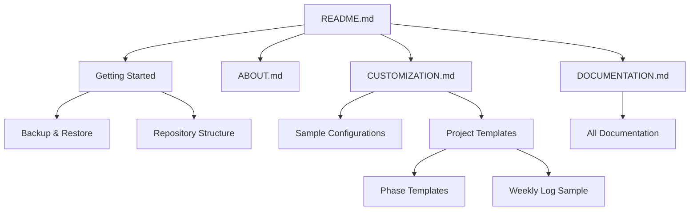

# 6/7 Coding Challenge Documentation Index

This guide provides a comprehensive overview of all available documentation for the 6/7 Coding Challenge.

## Core Documentation

| Document | Description |
|----------|-------------|
| [README.md](README.md) | Main overview and getting started |
| [ABOUT.md](docs/ABOUT.md) | Philosophy and motivation behind the challenge |
| [Getting Started](docs/getting-started.md) | Complete setup instructions and first steps |
| [Customization Guide](docs/CUSTOMIZATION.md) | How to tailor the challenge to your needs |

## Feature Documentation

| Feature | Documentation |
|---------|---------------|
| [Backup & Restore](docs/backup-restore-docs.md) | How to backup and restore your logs |
| [Retroactive Logging](docs/cc-log-enhancement-docs.md) | Logging entries for missed days |
| [Project Templates](docs/TEMPLATE_GUIDE.md) | Using and customizing project templates |
| [Repository Structure](docs/repo-structure.md) | Understanding the challenge directory structure |
| [Website Integration](docs/website-social-guide.md) | Integrating with websites and social media |

## Sample Files

| Document | Description |
|----------|-------------|
| [Sample Configurations](docs/SAMPLE_CONFIGURATIONS.md) | Example configurations for different use cases |
| [Phase 1 Sample](docs/TEMPLATES/phase1-sample.md) | Sample daily README for Phase 1 |
| [Weekly Log Sample](docs/TEMPLATES/weekly-log-sample.md) | Sample weekly log format |

## Advanced Documentation

| Document | Description |
|----------|-------------|
| [Contributing Guide](docs/CONTRIBUTING.md) | How to contribute to the project |
| [Scripts README](scripts/README.md) | Technical documentation for challenge scripts |

## Cross-Reference Map

## Version Information

Current version: 3.1.1

All documentation in this repository is maintained to be compatible with the current version. If you find any inconsistencies, please report them as an issue.